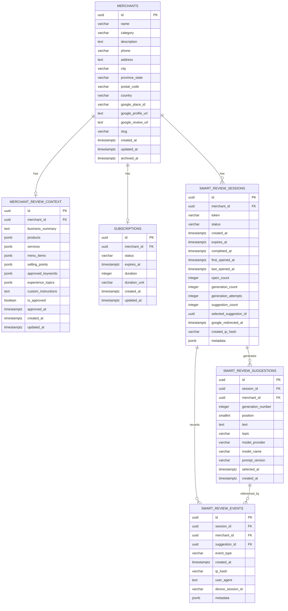

# Smart Reviewer MVP — Data Models

> **Superseded in places by [DECISIONS.md](DECISIONS.md)**, which is authoritative.
> Where this document and that one disagree, that one is correct.

## Scope

This document defines the simplified data model for the Smart Reviewer MVP.

Assumptions:

- Goopter is the only platform operator.
- There is no `tenant_id`, `organization_id`, or workspace model.
- Goopter supports multiple merchants.
- Customers leaving reviews do not need user accounts.
- The MVP focuses only on merchant setup, reviewer sessions, AI review suggestions, and event tracking.

## Model Overview

The MVP uses six core models:

1. `merchants`
2. `merchant_review_context`
3. `smart_review_sessions`
4. `smart_review_suggestions`
5. `smart_review_events`
6. `subscriptions`

## Relationship Overview

```text
merchants
  │
  ├── merchant_review_context
  │
  ├── subscriptions            (0..1 — the availability gate, DECISIONS.md R17)
  │
  └── smart_review_sessions
           │
           ├── smart_review_suggestions
           └── smart_review_events
```

## ERD



---

# 1. `merchants`

Represents each business supported by Goopter.

The merchant is the central business entity for the Reviewer MVP.

| Field | Type | Required | Notes |
|---|---|---:|---|
| `id` | `uuid` | Yes | Primary key |
| `name` | `varchar` | Yes | Merchant/business name |
| `category` | `varchar` | No | Restaurant, salon, dentist, etc. |
| `description` | `text` | No | General business description |
| `phone` | `varchar` | No | Merchant phone |
| `address` | `text` | No | Street address |
| `city` | `varchar` | No | City |
| `province_state` | `varchar` | No | Province/state |
| `postal_code` | `varchar` | No | Postal/ZIP code |
| `country` | `varchar` | No | Country |
| `google_place_id` | `varchar` | No | Google Maps Place ID |
| `google_profile_url` | `text` | No | Google Maps / Business Profile URL |
| `google_review_url` | `text` | Yes for active reviewer | Official Google review destination |
| `slug` | `varchar` | Yes | Human-readable identifier, unique. Not public — the QR carries the uuid |
| `created_at` | `timestamptz` | Yes | Creation timestamp |
| `updated_at` | `timestamptz` | Yes | Last update timestamp |
| `archived_at` | `timestamptz` | No | Soft-delete/archive timestamp. Nothing reads it (DECISIONS.md R17) |

### Constraints

```sql
PRIMARY KEY (id)
UNIQUE (google_place_id)
```

`google_place_id` can remain nullable until a Google business has been linked.

### No `status` column

Dropped by DECISIONS.md R17. Whether a merchant can be reviewed is answered by
`subscriptions` (§6) and nothing else — two independent notions of "switched
off" is one too many, and the suspension states (`CANCELLED`, `PAUSED`) belong
on the subscription that they suspend.

### Business Rule

A merchant can create a Smart Reviewer session only when it has a valid
`google_review_url` **and** an active subscription (§6).

---

# 2. `merchant_review_context`

Stores merchant-specific information used by the AI review-assistance engine.

This is intentionally separate from `merchants` so AI prompt/context data can evolve without cluttering the main merchant record.

| Field | Type | Required | Notes |
|---|---|---:|---|
| `id` | `uuid` | Yes | Primary key |
| `merchant_id` | `uuid` | Yes | FK to `merchants.id` |
| `business_summary` | `text` | No | AI-friendly summary |
| `products` | `jsonb` | No | Product names |
| `services` | `jsonb` | No | Services offered |
| `menu_items` | `jsonb` | No | Menu items where applicable |
| `selling_points` | `jsonb` | No | Approved differentiators |
| `approved_keywords` | `jsonb` | No | Merchant-approved keywords |
| `experience_topics` | `jsonb` | No | Food, service, atmosphere, value, etc. |
| `custom_instructions` | `text` | No | Additional AI context/instructions |
| `is_approved` | `boolean` | Yes | Whether context is approved for use |
| `approved_at` | `timestamptz` | No | Approval timestamp |
| `created_at` | `timestamptz` | Yes | Creation timestamp |
| `updated_at` | `timestamptz` | Yes | Last update timestamp |

### Constraints

```sql
PRIMARY KEY (id)
FOREIGN KEY (merchant_id) REFERENCES merchants(id) ON DELETE CASCADE
UNIQUE (merchant_id)
```

The MVP assumes one active review context record per merchant.

### Example Context

```json
{
  "products": [
    "beef pho",
    "spring rolls",
    "Vietnamese coffee"
  ],
  "selling_points": [
    "fast service",
    "large portions",
    "family owned"
  ],
  "approved_keywords": [
    "Richmond",
    "Vietnamese restaurant",
    "pho"
  ],
  "experience_topics": [
    "food",
    "service",
    "atmosphere",
    "value"
  ]
}
```

---

# 3. `smart_review_sessions`

Represents a temporary Reviewer session created for a merchant.

This is the main security boundary for the public-facing Smart Reviewer Web App.

| Field | Type | Required | Notes |
|---|---|---:|---|
| `id` | `uuid` | Yes | Internal primary key |
| `merchant_id` | `uuid` | Yes | FK to `merchants.id` |
| `token` | `varchar` | Yes | Secure public session token, stored directly (DECISIONS.md R2) |
| `status` | `varchar` | Yes | Current session status |
| `created_at` | `timestamptz` | Yes | Creation timestamp |
| `expires_at` | `timestamptz` | Yes | Expiration timestamp |
| `completed_at` | `timestamptz` | No | Completion timestamp |
| `first_opened_at` | `timestamptz` | No | First successful open |
| `last_opened_at` | `timestamptz` | No | Latest successful open |
| `open_count` | `integer` | Yes | Number of opens |
| `generation_count` | `integer` | Yes | Successful generations. Refunded when a generation fails |
| `generation_attempts` | `integer` | Yes | Never refunded. The hard ceiling on provider calls (DECISIONS.md R6a) |
| `suggestion_count` | `integer` | Yes | Total suggestions generated |
| `selected_suggestion_id` | `uuid` | No | Selected suggestion, if any |
| `google_redirected_at` | `timestamptz` | No | First/most relevant Google redirect |
| `created_ip_hash` | `varchar` | No | Optional privacy-preserving IP hash |
| `metadata` | `jsonb` | No | Extensible session metadata |

### Suggested Status Values

```text
ACTIVE
COMPLETED

(EXPIRED removed: expires_at is authoritative — DECISIONS.md R7.
 DISABLED removed with disabled_at — R7b.)
```

### Defaults

```text
open_count = 0
generation_count = 0
suggestion_count = 0
```

### Token Design

Do not expose the internal database ID as the session secret.

Recommended public URL:

```text
https://review.goopter.com/r/{secure_token}
```

Store the token directly (DECISIONS.md R2). Nothing behind it is confidential —
merchant name, category, and a public Google URL — so hashing would guard a prize
not worth taking while costing the ability to trace a session from a URL a
customer reports.

On request:

```text
incoming secure token
    ↓
lookup token
    ↓
validate expires_at > now()
    ↓
load merchant, validate google_review_url present
```

`status` is deliberately **not** checked: completion is a milestone, not a gate,
so a customer who reaches Google and presses back still finds their session.

### Constraints

```sql
PRIMARY KEY (id)
FOREIGN KEY (merchant_id) REFERENCES merchants(id)
UNIQUE (token)
```

`selected_suggestion_id` may be added as a foreign key after the suggestions table exists.

---

# 4. `smart_review_suggestions`

Stores AI-generated review-writing suggestions.

Each generation request can produce multiple suggestions.

| Field | Type | Required | Notes |
|---|---|---:|---|
| `id` | `uuid` | Yes | Primary key |
| `session_id` | `uuid` | Yes | FK to `smart_review_sessions.id` |
| `merchant_id` | `uuid` | Yes | FK to `merchants.id` |
| `generation_number` | `integer` | Yes | Generation batch number |
| `position` | `smallint` | Yes | Position within the batch |
| `text` | `text` | Yes | Generated suggestion |
| `topic` | `varchar` | No | Experience angle this suggestion was asked to cover (DECISIONS.md R16). Never rendered |
| `model_provider` | `varchar` | No | AI provider |
| `model_name` | `varchar` | No | Model used |
| `prompt_version` | `varchar` | No | Prompt/template version |
| `selected_at` | `timestamptz` | No | When selected |
| `created_at` | `timestamptz` | Yes | Generation timestamp |

### Example

Generation 1:

```text
generation_number = 1

position = 1 → Suggestion A
position = 2 → Suggestion B
position = 3 → Suggestion C
```

After the user clicks **Generate More Suggestions**:

```text
generation_number = 2

position = 1 → Suggestion D
position = 2 → Suggestion E
position = 3 → Suggestion F
```

### Constraints

```sql
PRIMARY KEY (id)
FOREIGN KEY (session_id) REFERENCES smart_review_sessions(id)
FOREIGN KEY (merchant_id) REFERENCES merchants(id)

UNIQUE (session_id, generation_number, position)
```

---

# 5. `smart_review_events`

Append-only activity log for the Smart Reviewer experience.

Use this table as the authoritative behavioral history instead of adding a new column to `smart_review_sessions` for every possible action.

| Field | Type | Required | Notes |
|---|---|---:|---|
| `id` | `uuid` | Yes | Primary key |
| `session_id` | `uuid` | Yes | FK to `smart_review_sessions.id` |
| `merchant_id` | `uuid` | Yes | FK to `merchants.id` |
| `suggestion_id` | `uuid` | No | FK to `smart_review_suggestions.id` |
| `event_type` | `varchar` | Yes | Type of user/system event |
| `created_at` | `timestamptz` | Yes | Event timestamp |
| `ip_hash` | `varchar` | No | Optional privacy-preserving IP hash |
| `user_agent` | `text` | No | Browser/device user agent |
| `device_session_id` | `varchar` | No | Optional privacy-preserving browser/session ID |
| `metadata` | `jsonb` | No | Event-specific data |

### Event Types

Only what the server actually witnesses. Editing happens in the browser and
stays there, so there is no SUGGESTION_EDITED; GENERATE_MORE_CLICKED is
derivable from generation_number > 1; REVIEW_COPIED is a field on
SESSION_COMPLETED.

```text
SESSION_CREATED
SESSION_OPENED
SUGGESTIONS_GENERATED
SUGGESTION_SELECTED
SESSION_COMPLETED       metadata: {review_copied: bool}
GENERATION_FAILED
```

### Example Event

```json
{
  "event_type": "SUGGESTION_SELECTED",
  "session_id": "session-uuid",
  "merchant_id": "merchant-uuid",
  "suggestion_id": "suggestion-uuid"
}
```

### Google Redirect Event

```json
{
  "event_type": "GOOGLE_REVIEW_CLICKED",
  "session_id": "session-uuid",
  "merchant_id": "merchant-uuid"
}
```

### Constraints

```sql
PRIMARY KEY (id)
FOREIGN KEY (session_id) REFERENCES smart_review_sessions(id)
FOREIGN KEY (merchant_id) REFERENCES merchants(id)
FOREIGN KEY (suggestion_id) REFERENCES smart_review_suggestions(id)
```

---

# 6. `subscriptions`

Determines how long a merchant's review link stays usable. This is the only
**availability** gate (DECISIONS.md R17) — there is no merchant status column.
`google_review_url` is checked separately and for a different reason: absent, a
merchant is misconfigured rather than switched off.

| Field | Type | Required | Notes |
|---|---|---:|---|
| `id` | `uuid` | Yes | Primary key |
| `merchant_id` | `uuid` | Yes | FK to `merchants.id`, **unique** |
| `status` | `varchar` | Yes | `ACTIVE` \| `CANCELLED` \| `PAUSED`. Default `ACTIVE` |
| `expires_at` | `timestamptz` | Yes | Persisted, never recalculated on read |
| `duration` | `integer` | Yes | Positive. The most recent term, not the total |
| `duration_unit` | `varchar` | Yes | `day` \| `month` \| `year`. Only `day` is implemented |
| `created_at` | `timestamptz` | Yes | First ever subscribed |
| `updated_at` | `timestamptz` | Yes | Last time the row moved — renewal or a status change |

### Constraints

```sql
PRIMARY KEY (id)
FOREIGN KEY (merchant_id) REFERENCES merchants(id) ON DELETE CASCADE
UNIQUE (merchant_id)

CHECK (status IN ('ACTIVE', 'CANCELLED', 'PAUSED'))
CHECK (duration_unit IN ('day', 'month', 'year'))
CHECK (duration > 0)
```

`varchar` + `CHECK` rather than a Postgres enum, matching `source` and the
session statuses. `ON DELETE CASCADE` matches `merchant_review_context` as the
code declares it: a subscription has no meaning without its merchant.

`UNIQUE (merchant_id)` is the whole index story — Postgres backs the constraint
with an index, and that index also serves the lookup on the session-creation
path. Do not add a second one.

### Business Rule

A merchant is **ACTIVE** when:

```text
a subscriptions row exists
AND status = 'ACTIVE'
AND now < expires_at
```

A merchant is **INACTIVE** when any of those fails — including having no
subscription row at all. Session creation is rejected with the existing
`409 merchant_unavailable`; the customer is never told which reason applied.

### Term arithmetic

```text
create   expires_at = local_midnight(tomorrow) + duration
renew    expires_at = max(expires_at, local_midnight(tomorrow)) + duration
```

Midnight is **exclusive** and resolved in `OPERATOR_TIMEZONE`, then stored as
UTC. A 30-day term created 12 Aug stores `12 Sep 00:00` local — the merchant's
last valid day is **11 Sep**. Any UI showing an expiry date must render the last
valid day, not this column.

Renewal extends from the later of the current expiry and today, so renewing
early never burns paid days and a lapsed subscription is never credited dead
time. Full rationale, including the DST rule for adding the term, is in
DECISIONS.md R18.

### Suspension

`CANCELLED` and `PAUSED` close the gate. Neither moves `expires_at` and neither
credits the suspended time back — resuming is `status = 'ACTIVE'` and nothing
else (R19).

---

# Recommended Indexes

## Merchants

```sql
CREATE UNIQUE INDEX merchants_google_place_id_idx
ON merchants (google_place_id)
WHERE google_place_id IS NOT NULL;
```

## Subscriptions

None beyond the index Postgres creates for `UNIQUE (merchant_id)`, which is also
the session-creation lookup. No index on `expires_at`: nothing scans for
expiring subscriptions, because nothing warns before expiry (DECISIONS.md S1).

## Smart Review Sessions

```sql
CREATE UNIQUE INDEX smart_review_sessions_token_idx
ON smart_review_sessions (token);

CREATE INDEX smart_review_sessions_merchant_idx
ON smart_review_sessions (merchant_id);

CREATE INDEX smart_review_sessions_expiry_idx
ON smart_review_sessions (expires_at);

CREATE INDEX smart_review_sessions_status_idx
ON smart_review_sessions (status);
```

## Smart Review Suggestions

```sql
CREATE INDEX smart_review_suggestions_session_idx
ON smart_review_suggestions (session_id);

CREATE INDEX smart_review_suggestions_session_generation_idx
ON smart_review_suggestions (session_id, generation_number);
```

## Smart Review Events

```sql
CREATE INDEX smart_review_events_session_time_idx
ON smart_review_events (session_id, created_at);

CREATE INDEX smart_review_events_merchant_time_idx
ON smart_review_events (merchant_id, created_at);

CREATE INDEX smart_review_events_type_time_idx
ON smart_review_events (event_type, created_at);
```

---

# MVP Data Flow

## 1. Merchant Setup (Via the lead crawler — DECISIONS.md R20)

```text
Operator searches Google Places in /leads
        ↓
Save → create merchants record (Place ID, review URL, snapshot)
        ↓
Auto-fill merchant_review_context from Place Details
        ↓
Subscribe the merchant → create subscriptions row
        ↓
The /m/{merchantId} URL now works
```

There is no seed script and no YAML. Until the subscription exists the merchant
is INACTIVE and its URL redirects to `/unavailable`.

## 2. Create Review Session

```text
Customer scans QR → GET /m/{merchantId}
        ↓
Backend validates merchant + subscription, creates smart_review_sessions row
        ↓
302 → /r/{token}          Cache-Control: no-store
```

Served by FastAPI, not the frontend (DECISIONS.md, Architecture revision).

Example:

```text
https://review.goopter.com/r/AbC123SecureRandomToken...
```

## 3. Open Reviewer

```text
Gets redirected to url with session token
        ↓
Backend hashes supplied token
        ↓
Find smart_review_sessions
        ↓
Check:
  expires_at > NOW()
        ↓
Load merchant (must still have google_review_url)
        ↓
Load merchant_review_context
        ↓
Record SESSION_OPENED
```

## 4. Generate Suggestions

```text
Session
   ↓
Merchant context
   ↓
AI generation
   ↓
smart_review_suggestions
   ↓
SUGGESTIONS_GENERATED event
```

## 5. Customer Selects Suggestion

```text
Customer clicks Use This Review
        ↓
Record SUGGESTION_SELECTED
        ↓
Update selected_suggestion_id
        ↓
Copy text
        ↓
Record SUGGESTION_COPIED
```

## 6. Continue to Google

```text
Customer clicks Continue to Google Reviews
        ↓
Record GOOGLE_REVIEW_CLICKED
        ↓
Redirect to merchants.google_review_url
```

---

# MVP Tables Summary

```text
merchants
    Businesses supported by Goopter

merchant_review_context
    Merchant-approved information supplied to AI

subscriptions
    How long a merchant's review link stays usable — the availability gate

smart_review_sessions
    Secure, expiring public Reviewer sessions

smart_review_suggestions
    AI-generated suggestion history

smart_review_events
    Append-only Reviewer interaction events
```

---

# Recommended MVP Principle

Keep the Reviewer MVP centered on this relationship:

```text
Merchant
   ↓
Review Session
   ↓
AI Suggestions
   ↓
User Interaction Events
   ↓
Google Review Page
```

Everything else should be added only when another product requirement actually needs it.
